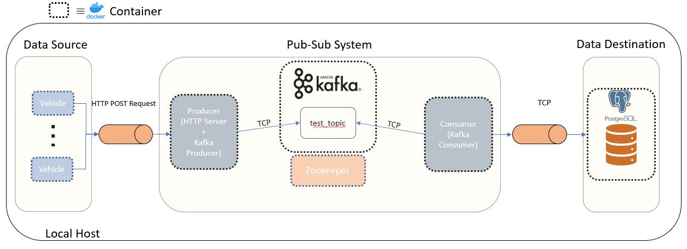

# kafka-python-postgres-etl

This project demonstrates a streaming ETL pipeline. It is containerized using
Docker.

The main goal is to monitor and store real-time streaming data from a fleet of vehicles.

Each vehicle (`vehicle.Vehicle`) produces some data (in this revision, just position and speed over time plus some metadata) at small, regular time intervals.
Each vehicle's data is sent to an HTTP server (`producer.Producer`), where it is transformed into a JSON string and published to a Kafka topic (default `test_topic`).
A Kafka consumer (`consumer.Consumer`) will consume the published JSON string from the topic, structure the data, and then insert it into a PostgreSQL database.

## Getting Started

Ensure a Docker daemon is running and there are no services occupying ports
9092, 5432, 2181, and 5000 (if these ports are not available, the host:container port mapping can be modified in `config.master`).

Pull the master branch and navigate to repo root. Execute:

    $bash launch_infra.sh
    $bash launch_fleet.sh

## Architecture

A dichotomy can be made of this project's components: server infrastructure (or just "infrastructure") vs. clients.

### Infrastructure

The server infrastructure has one or more of the following containers:

- [m4ttl33t/postgres](https://hub.docker.com/r/m4ttl33t/postgres) -- PostgreSQL data store (small extension of official image)
- [m4ttl33t/consumer](https://hub.docker.com/r/m4ttl33t/consumer) -- Kafka Consumer / SQL writer
- [m4ttl33t/producer](https://hub.docker.com/r/m4ttl33t/producer)-- Kafka Producer / HTTP server
- [bitnami/kafka:latest](https://hub.docker.com/r/bitnami/kafka) -- Kafka broker(s)
- [bitnami/zookeeper:latest](https://hub.docker.com/r/bitnami/zookeeper) -- Zookeeper to administrate Kafka brokers

As of this revision, this infrastructure is "single-node" and operates locally for demonstration purposes. Each container
communicates over a Docker bridge network. Ideally, most (if not all) of this infrastructure should reside in the cloud across
several machines.

### Clients

A fleet of vehicles (clients) are realized by one or more of the following containers:

- [m4ttl33t/vehicle](https://hub.docker.com/r/m4ttl33t/vehicle) -- HTTP client that constantly streams its own data

As of this revision, many of these containers can be instantiated on many different machines. The only requirement is
that they are given the correct host address of the HTTP server, e.g., the `producer` container, to send requests to.

## Testing

### End-to-End Tests

If you've followed the instructions in the **Getting Started** section, there are a few things you can do to check
that things are working as expected:

1. Enter the relevant HTTP server URL into your browser. There should be a "welcome message" with an event counter that
  increments every few seconds. Unless you've changed any `config.*` files, the port and endpoint is 5000 and 'events', respectively,
  and the IP address should be printed to stdout (or stored in `/tmp/launch_infra_http_server.log`).

>Example: 172.60.49.4:5000/events

2. Interact with the postgres container directly through bash - you should see the entries grow every few seconds:

    >sudo docker exec -it -u postgres postgres bash
    >psql
    >\c av_telemetry
    >SELECT * FROM diag;

### Unit Tests

There are many unit tests contained in the `tests` folder. Navigate to the root repo folder and execute:

    python -m pytest tests -W ignore::DeprecationWarning -v

## Contributing

The `.py` files in this repository follow a relaxed PEP8 style guide. You can check compliance using
the .pylintrc at repo root.
