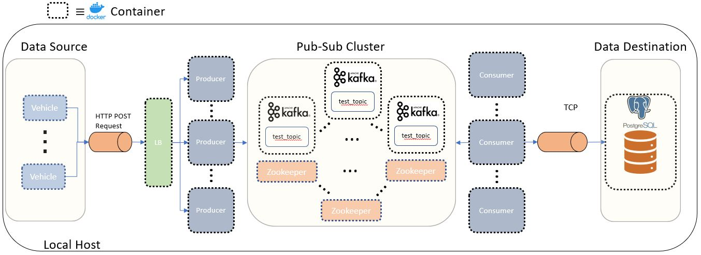

# kafka-python-postgres-etl

This project demonstrates a containerized, Python-based, Kafka cluster for real-time streaming (and ETL) of vehicle data. It is written in Python 3.6 (see `requirements.txt`).

There are two main goals:
1. To monitor and store real-time streaming data from a *fleet* of vehicles using Apache Kafka.
2. To demonstrate how the infrastructure for such an application may be automatically provisioned (IaC) and scaled.

Here's a short blurb about how it works:

Each vehicle (`vehicle.Vehicle`) produces some data (in this revision, just position and speed over time plus some metadata) at small, regular time intervals.
Vehicle data is sent at regular intervals to Kafka Producers (`producer.Producer`) through a nginx load balancer. The data is transformed into a JSON string and published to a Kafka topic (default `test_topic`). Kafka consumers (`consumer.Consumer`) will consume the published JSON string from the Kafka topic, structure the data, and then insert it into a PostgreSQL database.

## Getting Started

The bash scripts rely on Bash v4+ and `jq` to parse JSON. If this is not installed in your environment, then run the following:

    $sudo apt-get update
    $sudo apt-get install jq

Ensure a Docker daemon is running and there are no services occupying the `XXX_HOST_PORT` in `config.master` (or change these in `config.master`).

Pull the master branch and navigate to repo root. Execute:

    $bash launch_infra.sh -c /path/to/config/config.master
    $bash launch_fleet.sh -c /path/to/config/config.master [--num-vehicles <N>]

>Can use -v flag for verbosity -- see the help menu(s)

When you're finished, you can similarly tear down the containers:

    $bash teardown_fleet.sh
    $bash teardown_infra.sh -c /path/to/config/config.master

## Architecture

A dichotomy can be made of this project's components: server infrastructure (or just "infrastructure") vs. clients.

### Infrastructure

The server infrastructure has one or more of the following containers:

- [_/nginx:1.23](https://hub.docker.com/_/nginx) -- nginx load balancer (official image)
- [_/postgres:15.0](https://hub.docker.com/_/postgres) -- PostgreSQL data store (official image)
- [m4ttl33t/consumer](https://hub.docker.com/r/m4ttl33t/consumer) -- Kafka Consumer / SQL writer
- [m4ttl33t/producer](https://hub.docker.com/r/m4ttl33t/producer)-- Kafka Producer / HTTP server
- [bitnami/kafka:3.3.1](https://hub.docker.com/r/bitnami/kafka) -- Kafka broker(s)
- [bitnami/zookeeper:3.7.1](https://hub.docker.com/r/bitnami/zookeeper) -- Zookeeper to administrate Kafka brokers

This infrastructure is highly scalable, i.e., all containers except Postgres and nginx can be duplicated to work in tandem:

For Kafka Brokers, more instances enable higher data replication.
For Zookeepers, more instances means more fault tolerance*.
For Kafka clients (Producers and Consumers), more instances means higher throughput. The Producers are load balanced via nginx. The Consumers are automatically load balanced by Kafka
since they all belong to the same consumer group and there is one partition.

*This infrastructure operates locally for demonstration purposes, where each container communicates over a Docker bridge network. The notion of fault tolerance is weak,
since bringing the one, local machine down will bring down every container anyway!

### Security

Given this is strictly a development environment, there are little security concerns -- every container is supposed to run on one's local machine on a private network.
Therefore, little provisions have been made to secure the Kafka cluster or the `Vehicle`<->`LB` comms.

For the NGINX LB, the SSL provisions are commented out in the config file, and a dummy private key is included in this repo. Again, you wouldn't include such
keys if they were meaningful in prod, but these inactive security provisions are here for the sake of simple demonstration.

For the Kafka cluster, the security protocol is PLAINTEXT. In production envs, this could change; Apache Kafka comes with a few options for implementing enhanced security. The clients (producers and consumers) can authenticate with brokers via SSL or SASL. Brokers can authenticate with Zookeeper through SASL and/or mTLS. Further, the data transfer between
most cluster components can also be encrypted via SSL, and specific authorizations can be granted for specific operations between specific entities
in the cluster. This is a big topic that isn't studied here.

### Kafka Cluster

Apache Kafka is used as the main publish-subscribe system. In general, a production-grade cluster would be distributed across multiple,
physical servers in varying topologies depending on the use case. Here, in this development-grade cluster, only one physical server 
is used; a multi-node cluster architecture is realized through multiple Kafka (and Zookeeper) containers.

These differing cases (true multi-server vs local multi-container) are not so different with respect to Kafka internals: there are still multiple brokers
to provide data redundancy; there are still multiple consumers to read
from each partition; zookeeper containers still elect leaders when a container fails, etc. At least one big difference or drawback
with the local, multi-container case is there is **only one machine** -- bringing the _machine_ down brings down the whole cluster!

#### Consumers

The consumers all belong to one group and use one message key.

Having one message key ensures the same partition is being consumed from each time, in order.
Given that there is only one 'thing' consumed, namely the AV stream of diagnostics, this is convenient.

The consumer all belong to one group for load balancing. If all the consumer instances have the same consumer group,
then the records will effectively be load-balanced over the consumer instances.

#### A Note About Zookeeper

In this project, Kafka brokers explicitly connect to a Zookeeper _ensemble_. An ensemble is a collection of Zookeeper instances that operate in a "quorum";
a majority of the Zookeeper instances must acknowledge a message transaction for it to be committed. An odd number of Zookeeper servers is enforced for this reason.

Historically, Zookeeper was needed to manage the metadata of Kafka, i.e.,
service discrovery, broker election in leader-follower roles, topic creation, etc. If Zookeeper goes down entirely, Kafka can still handle the data
stream on an already-created topic, but you would not be able to create new topics or brokers.

Apache Kafka 2.8.0+ has done away with the reliance on Zookeeper. Instead, a Kafka Raft metadata (KRaft) mode can be activated to carry out
required metadata activities formerly left to Zookeeper. This is supposed to present an easier-to-manage and more performant cluster.
See [KIP-500](https://cwiki.apache.org/confluence/display/KAFKA/KIP-500%3A+Replace+ZooKeeper+with+a+Self-Managed+Metadata+Quorum).

### Clients

A fleet of vehicles (clients) are realized by one or more of the following containers:

- [m4ttl33t/vehicle](https://hub.docker.com/r/m4ttl33t/vehicle) -- HTTP client that constantly streams its own data

As of this revision, many of these containers can be instantiated on many different machines. The only requirement is
that they are given the correct host address of the nginx load balancer to send requests to. This is done automatically by
parsing the IP address from the nginx Docker container. Thus, one must launch the Infrastructure before launching Clients.

## Testing

### End-to-End Tests

If you've followed the instructions in the **Getting Started** section, there are a few things you can do to check
that things are working as expected:

1. Enter a HTTP server URL into your browser. You can get this from stdout if you've enabled verbosity (`-v`), or look in `config.master.HTTP_LOG`. There should be a "welcome message" with an event counter that increments every few seconds. Unless you've changed anything in `config.master` files, the port and endpoint is 5001 and 'events', respectively.

>Example: 172.60.49.4:5001/events

2. Interact with the postgres container directly through bash. You should see the entries grow every few seconds. Unless you've changed anything `config.master` files,

        sudo docker exec -it -u postgres postgres bash
        psql
        \c av_telemetry
        SELECT * FROM diag;

### Unit Tests

There are many unit tests contained in the `tests` folder. Navigate to the root repo folder and execute:

    python -m pytest tests -W ignore::DeprecationWarning -v

To run these tests, one should have the correct Python environment, e.g., built from `requirements.txt` with Python 3.6

## Contributing

The `.py` files in this repository follow a relaxed PEP8 style guide. You can check compliance using
the .pylintrc at repo root:

    $pylint <file>.py --rcfile=.pylintrc

## Future Work

This project is done all on my own time outside of work hours, so it's not where I want it to be (but it will be one day soon!).
Near-future changes to come:

- Encrypt the Kafka comms with SSL
- Add web-based visualizations for streaming data
- Add IaC for cloud migration
